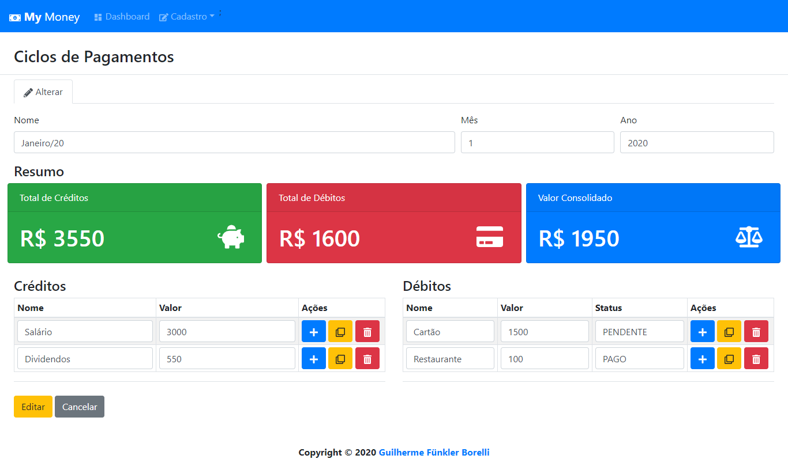

<h1 align="center">
	Money Manager
</h1>

 

  
 
Caso deseje ver outras imagens da aplicação basta acessar o link: https://www.imagemhost.com.br/album/L8ri

<h4 align="center">
  Guilherme Fünkler Borelli
</h4>

  <a href="#wrench-tecnologias">Tecnologias</a>&nbsp;&nbsp;&nbsp;|&nbsp;&nbsp;&nbsp;
  <a href="#-projeto">Projeto</a>&nbsp;&nbsp;&nbsp;|&nbsp;&nbsp;&nbsp;
  <a href="#memo-observações">Observações</a>

## :wrench: Tecnologias

Esse projeto foi desenvolvido com as seguintes tecnologias:

- [Node.js](https://nodejs.org/en/)
- [React](https://reactjs.org)
- [MongoDB](https://www.mongodb.com/)
- [Redux](https://redux.js.org/)
- Diversas tecnologias menores como React Bootstrap, React Icons, Redux-Form Create-React-App etc

## 💻 Projeto

O Money Manager é um projeto que visa facilitar o controle das finanças.

## :memo: Observações

A aplicação ainda se encontra em desenvolvimento e possúi pequenos bugs que estou corrigindo, em especial relaciado ao redux-form.

É necessário ter o mongo instalado e configurado para o backend funcionar corretamente.

Para rodar a aplicação utilizar o comando 'npm i' nos diretórios 'backend' e no 'frontend', após concluída a instalação dos pacotes, utilizar os comandos 'npm start' nos diretórios 'backend' e no 'frontend', a aplicação iniciará automaticamente.
